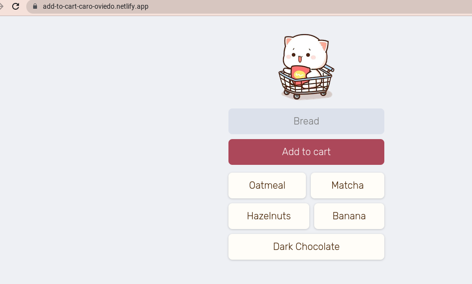
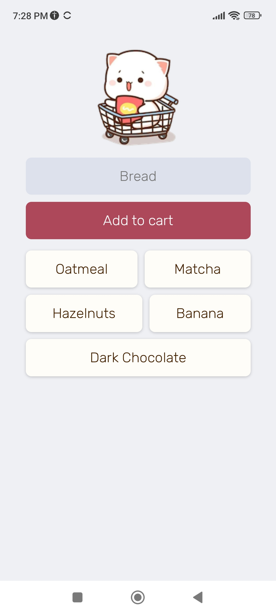

# Add To Cart | Web App
Scrimba project 

## Topics

+ Netlify
+ Import
+ Firebase
- initializeApp
- getDatabase
- reference
- push
- onvalue
- snapshot
- Ids
- remove
+ Object --> Array
+ createElement
+ user-select
+ Favicon
+ Web Application Manifest
  

